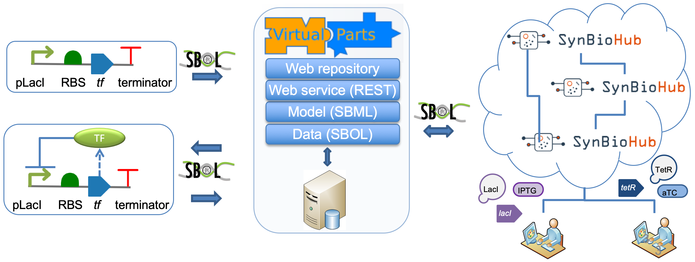
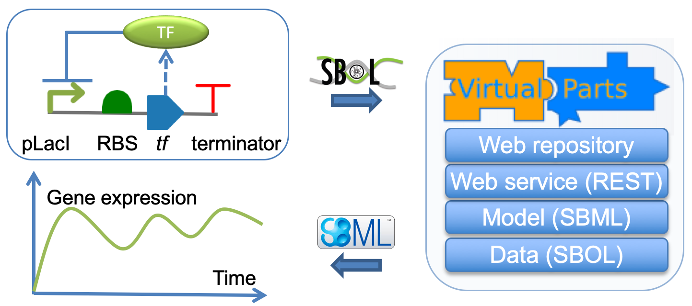
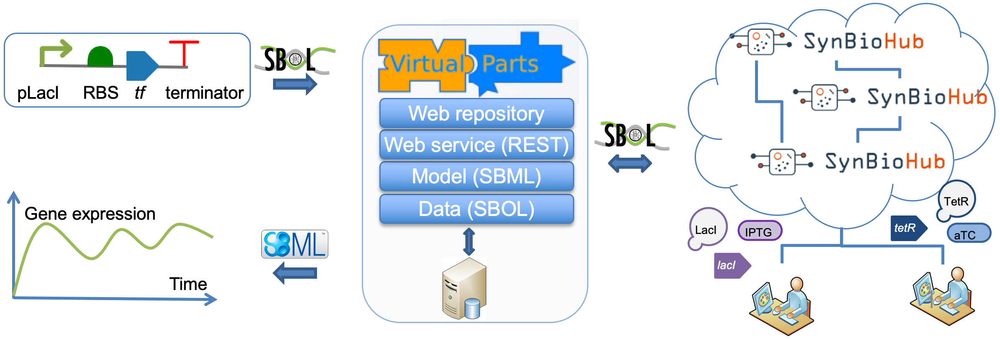

# Virtual Parts Repository 2.0 (VPR2)
Virtual parts are modular and reusable mathematical models of biological parts.
Here, we describe various components of VPR2, the new version of the Virtual Parts Repository. The previous version is available at virtualparts.org. VPR2 has a Web-based repository, a Web service and a data layer. Both the Web service and the data layer can be used to connect to different synbio repositories that are enabled by the Synthetic Biology Open Language (SBOL).

<span style="color:blue">**Please note that the VPR2 project is under development**</span>.

The following sections provides descriptions of VPR2 components and how they can be accessed.

## VPR2 Repository
VPR2 has its own data repository and is accessible as a web application. The repository is available at [http://virtualparts.org](http://virtualparts.org) and allows searching for parts, and downloading computational models and genetic descriptions of these parts. 
## VPR SPARQL Endpoint
The SPARQL endpoint for VPR2 is available at [http://virtualparts.org/rdf4j-server/repositories/vpr28](http://virtualparts.org/rdf4j-server/repositories/vpr28).
The URL can be used to submit SPARQL queries to VPR2.
 
## VPR2 Web Service (VPR2-WS)
VPR2 web service is REST-based and includes several methdods that can be accessed by computational tools. The development version is available at [http://virtualparts.org/virtualparts-ws/webapi](http://virtualparts.org/virtualparts-ws/webapi). Please see list of available methods as a Web Application Description Language (WADL) file at [http://virtualparts.org/virtualparts-ws/webapi/application.wadl](http://virtualparts.org/virtualparts-ws/webapi/application.wadl).

Please use the VPR2 SPARQL endpoint URL to fetch data from the local VPR2 repository using this web service. The following example uses the command-line curl command to submit requests to the VPR2 web service and relies on the VPR2 SPARQL endpoint:
```
curl  -X POST "http://virtualparts.org/virtualparts-ws/webapi/component/fetch" -d 'stackuri=http://virtualparts.org/rdf4j-server/repositories/vpr28' -d 'componenturi=http://www.bacillondex.org/BO_31362/1'
```
### VPR2 Web Service Methods
The web service provides methods to retrieve models  and information about biological parts and interactions. Some of the web service methods are summarised below.
* Model -  via a repository
  * model/sbol_fromstack: Returns a model for a genetic design specified in SBOL
  * model/svpwrite_fromstack: Returns a model for a design specified in SVPWrite
  * model/component: Returns the model of a part  
* Model -  without a repository
  * model/sbol for disconnected mode
  * model/svpwrite for disconnected mode
* Component - via a repository
  * component/fetch: Retrieves details of a part 
  * component/fetch/sub: Retrieves details of a subcomponents 
  * component/search: Search for parts using a part template
  * component/count: Returns the number of part definitions for given search criteria
* Interaction - via a repository
  * interaction/summary: To retrieve interacting parts for a specified part 
  * interaction/fetch: To retrieve information for an interaction
  * interaction/fetchDetailed: To retrieve detailed information for an interaction
  * interaction/populate: Add interactions for a given genetic design

## VPR2 Web Service Client
Although, the Web service can directly be accessed by tools, we also provide a Java client library to facilitate programmatic access. The client library is provided as a single Java Jar file that contain all dependencies and can be downloaded from [https://github.com/dissys/vprwiki/releases](https://github.com/dissys/vprwiki/releases).

## VPR2 Data
VPR2 is a standalone library that can be used to populate SBOL designs with additional details from remote SBOL repositories. VPR2 Data is also included as a dependency as part of the client library and is ideal for users who want to implement their own modelling abstractions. VPR2 Data is available at [https://github.com/ICO2S/vpr-data](https://github.com/ICO2S/vpr-data).


## Using the VPR2 Web Service Client
The Web service can be used to create models directly from SBOL files. Basic information about designs in the form of SBOL documents can also be used to retreve detailed information from a specified repository.

### Using the library in disconnected mode
This option allows users to specify genetic circuits using SBOL to create models based on the constraints specified. The SBOL designs should include all the biological interactions, except degradation reactions which are added automatically by the VPR2.

The following code creates an SBML model using an SBOL design as a parameter. The SBML model is specified in the SBML Level 3 format which is the latest SBML version and supports hierarchical models.

```java
WebTarget target = VPRWebServiceClient.getVPRWebServiceTarget(VPR_WS);
SBMLDocument sbmlDoc = VPRWebServiceClient.getModel(target, sbolDesign);
```


### Using the library in connected mode
This option allows users to specify basic information about about genetic circuit design and retrive an SBML model using the information from a remote data repository, which may be the default VPR repository or another SBOL enabled repository such as a SynBioHub instance.

The following code creates an SBML model using an SBOL design as a parameter. An additional parameter is also used to specify the URI of the SPARQL interface of the remote repository.
```java
WebTarget target=VPRWebServiceClient.getVPRWebServiceTarget(VPR_WS);
SBOLDocument sbolDesign=SVPWriteHandler.convertToSBOL(design,"tu");    	    	    	
SBMLDocument sbmlDoc=VPRWebServiceClient.getModelUsingDataFromStack(target, sbolDesign, VPR_Repository);    	
```

### Creating SBOL designs
VPR2's client library is ideal to create SBOL designs and to retrieve SBML models (see "Using the VPR2 Web Service Client"). This library provides both the syntax and the semantics when creating SBOL designs. Please note that that the libSBOLj java library is already included as part of the VPR2 client library. Alternatively, simple designs can be constructed via the SVPWrite language using the following notation. Note that each part id-type pair MUST be separated by a semicolon. The LAST pair MUST NOT be followed by a semicolon.
```
<partid>:<parttype>
```

Part types in SVPWrite are:
* prom : Promoter
* cds : CDS
* rbs :RBS
* ter : Terminator
* op :Operator
* shim : Spacer
* eng : Engineered Region

The following example creates the prom1-rbs1-cds1-ter1 design where prom1 is a promoter, rbs1 is an RBS, cds1 is a CDS and ter1 is a terminator.
```java
String design="prom1:prom;rbs1:rbs;cds1:cds;ter1:ter";
SBOLDocument sbolDesign=SVPWriteHandler.convertToSBOL(design,"tu");    
```

SBOL equivalents of newly created design components can be referred to directly from the SBOL documents as shown below. The cds1 component is retrieved back as an SBOL ComponentDefinition object, which can then be used to define interactions.

```java
ComponentDefinition cdsCompDef=sbolDesign.getComponentDefinition(URI.create(sbolDesign.getDefaultURIprefix() + "cds1"));  
```

### Adding information about biological interactions
In order to create interactions in the disconnected mode, interactions must be fully specified. Interactions MUST be created using the interaction types presented in [https://pubs.acs.org/doi/abs/10.1021/acssynbio.7b00459](https://pubs.acs.org/doi/abs/10.1021/acssynbio.7b00459). The VPR provides SBOLInteraction class to guarantee that the interactions are created correctly. Interactions must be created as part of a single SBOL ModuleDefinition which is the container entity for biological interactions. The VPR library supports the following interactions.

* Promoter repression
* Promoter activation
* Protein-DNA binding
* Complex formation between biological molecules
* Phosphorylation
* Auto dephosphorylation

The example below creates a ModuleDefinion as a container store information about interactions. Next, it creates two interactions. The first interaction represents the translation of the LacI protein from the lacI coding sequence. The second interaction represents the repression of the pTac promoter by the LacI protein.

```java
ModuleDefinition moduleDef=sbolDesign.createModuleDefinition("design_module");
SBOLInteraction.createTranslationInteraction(moduleDef, lacI, LacI);
SBOLInteraction.createPromoterRepression(moduleDef, pTac, LacI);
```

### Controlling kinetic rate parameters
The VPR library populates SBML models with default values. These values can also be controlled by the user. Often, parameters are properties of interaction objects. For example, the following code creates a repression interaction. The forward rate of this interaction can be overwritten by the user. In the example, the new value is set to 0.1.
```java
Interaction repression=SBOLInteraction.createPromoterRepression(moduleDef, pTac, LacI);
repression.createAnnotation(VPRTerms.toQName(VPRTerms.parameter.kforward,VPRTerms.Ns.getPrefix()), "0.1"); 
```

### Saving models
The VPR returns an object representing the model using rhe jSBML library. This model can directly be written to a file.
```java
SBMLWriter.write(sbmlDoc, "repressibleTU_Disconnected.xml",' ', (short) 2); 
```

### Creating SBOL designs using external tools
SBOL designs can also be created using different SBOL tools and libraries in order to use the VPR2 web service via HTTP directly. VPR2 requires that such SBOL designs provide the necessary semantics about the types, and roles, of biological components and molecular interactions.

| Part      | SBOL Component type | SBOL Component Role|
| ----------- | ----------- |----------- |
| Promoter | http://www.biopax.org/release/biopax-level3.owl#DnaRegion | http://identifiers.org/so/SO:0000167 |
| CDS | http://www.biopax.org/release/biopax-level3.owl#DnaRegion | http://identifiers.org/so/SO:0000316 |
| RBS | http://www.biopax.org/release/biopax-level3.owl#DnaRegion | http://identifiers.org/so/SO:0000139 |
| Terminator | http://www.biopax.org/release/biopax-level3.owl#DnaRegion | http://identifiers.org/so/SO:0000141 |
| Operator | http://www.biopax.org/release/biopax-level3.owl#DnaRegion | http://identifiers.org/so/SO:0000057 |
| Shim/Spacer | http://www.biopax.org/release/biopax-level3.owl#DnaRegion | http://identifiers.org/so/SO:0000804 |
| Protein | http://www.biopax.org/release/biopax-level3.owl#Protein |  |

Interaction types should be set as below. In addition, each interaction includes a list of participants and how their roles should be set.
* Genetic Production : http://identifiers.org/biomodels.sbo/SBO:0000589
  * CDS Participation Role: http://identifiers.org/biomodels.sbo/SBO:0000645
  * Product Participation Role: http://identifiers.org/biomodels.sbo/SBO:0000011
* Promoter repression: http://identifiers.org/biomodels.sbo/SBO:0000169
  * TF Participation Role: http://identifiers.org/biomodels.sbo/SBO:0000020 
  * Promoter Participation Role: http://identifiers.org/biomodels.sbo/SBO:0000642
* Promoter activation:http://identifiers.org/biomodels.sbo/SBO:0000170
  * TF Participation Role: http://identifiers.org/biomodels.sbo/SBO:0000459
  * Promoter Participation Role: http://identifiers.org/biomodels.sbo/SBO:0000643
* Protein-DNA binding: http://identifiers.org/biomodels.sbo/SBO:0000177
  * Protein Participation Role: http://identifiers.org/biomodels.sbo/SBO:0000010
  * DNA Participation Role: http://identifiers.org/biomodels.sbo/SBO:0000010
  * Protein-DNA Complex Participation Role: http://identifiers.org/biomodels.sbo/SBO:0000011
* Complex formation between two biological molecules, except DNA components: http://identifiers.org/biomodels.sbo/SBO:0000177  
  * Molecule 1 Participation Role: http://identifiers.org/biomodels.sbo/SBO:0000010
  * Molecule 2 Role: http://identifiers.org/biomodels.sbo/SBO:0000010
  * Molecule 1 - Molecule 2 Complex Participation Role: http://identifiers.org/biomodels.sbo/SBO:0000011
* Complex formation between two biological molecules involving a modifier (e.g. IPTG) except DNA components: http://identifiers.org/biomodels.sbo/SBO:0000177
  * Molecule Participation Role: http://identifiers.org/biomodels.sbo/SBO:0000010
  * Modifier Role: http://identifiers.org/biomodels.sbo/SBO:0000019
  * Molecule-Modifier Complex Participation Role: http://identifiers.org/biomodels.sbo/SBO:0000011
* Dimerisation : http://identifiers.org/biomodels.sbo/SBO:0000177 
  * Molecule Participation Role: http://identifiers.org/biomodels.sbo/SBO:0000010
  * Dimer Participation Role: http://identifiers.org/biomodels.sbo/SBO:0000011
* Phosphorylation:  http://identifiers.org/biomodels.sbo/SBO:0000216  
  * Donor Participation Role: http://identifiers.org/psimi/MI:0842
  * Acceptor Participation Role: http://identifiers.org/psimi/MI:0843
* Phosphorylation with Modifier:  http://identifiers.org/biomodels.sbo/SBO:0000216 
  * Modifier Participation Role: http://identifiers.org/biomodels.sbo/SBO:0000019
  * Acceptor Participation Role: http://identifiers.org/psimi/MI:0843
* Auto dephosphorylation: http://identifiers.org/biomodels.sbo/SBO:0000330 
  * Donor Participation Role: http://identifiers.org/psimi/MI:0842
  
# Examples
Below you can find complete examples, using the Java web service client API or using the web service directly via the command line CURL tool. As a result of each exmaple, an SBML model is generated. This model can be simulated using the COPASI tool.

Example files are available from the [wikiexamples folder](https://github.com/dissys/vprwiki/tree/master/wikiexamples).

## Ex1: A simple genetic production - disconnected
This example shows how to create a simple genetic circuit that encodes for a protein. 
### Ex1: Using the VPR2-WS Client API
```java
String design="prom1:prom;rbs1:rbs;cds1:cds;ter1:ter"; 
WebTarget target=VPRWebServiceClient.getVPRWebServiceTarget(VPR_WS);
SBMLDocument sbmlDoc=VPRWebServiceClient.getModel(target, design);
SBMLWriter.write(sbmlDoc, "repressibleTU_DisconnectedSimple.xml",' ', (short) 2);  
```

### Ex1: Using the Curl command line tool and the VPR2-WS
repressibleTU_DisconnectedSimple.svp file:
```
prom1:prom;rbs1:rbs;cds1:cds;ter1:ter
```

Specify a genetic circuit as a curl parameter:
```
curl -X POST "http://virtualparts.org/virtualparts-ws/webapi/model/svpwrite" --data-urlencode 'svpwrite=prom1:prom;rbs1:rbs;cds1:cds;ter1:ter' -d 'modeltype=sbml_l3' -d 'abstractionlevel=simple'
```

Specify a genetic circuit as a curl parameter that refers to the input SVPWrite file:
```
curl -X POST "http://virtualparts.org/virtualparts-ws/webapi/model/svpwrite" --data-urlencode svpwrite@repressibleTU_DisconnectedSimple.svp -d 'modeltype=sbml_l3' -d 'abstractionlevel=simple' 
```

Specify a genetic circuit as a curl parameter that refers to the input SVPWrite file. The output will be written to an SBML file.
```
curl -X POST "http://virtualparts.org/virtualparts-ws/webapi/model/svpwrite" --data-urlencode svpwrite@repressibleTU_DisconnectedSimple.svp -d 'modeltype=sbml_l3' -d 'abstractionlevel=simple' > repressibleTU_DisconnectedSimple.xml
```

Curl command with the parameters explained:
```
curl -X POST "http://virtualparts.org/virtualparts-ws/webapi/model/svpwrite"	--> The VPR web interface to use the SVPWrite strings
		--data-urlencode svpwrite@repressibleTU_DisconnectedSimple.svp	-->svpwrite parameters include the local file name containing the design
		-d 'modeltype=sbml_l3'	--> Model type is SBML L3
		-d 'abstractionlevel=simple'	--> The VPR2 modelling abstraction is specified 
	> repressibleTU_DisconnectedSimple.xml	--> Write the SBML output to repressibleTU_DisconnectedSimple.xml
```
  
### Ex2: Incorporating constraints between parts - disconnected
This example builds upon the previous one by adding with molecular interactions.

### Ex2: Adding molecular interactions and retrieving the corresponding model using the VPR2-WS Client API
```java
String design="prom1:prom;rbs1:rbs;cds1:cds;ter1:ter";
SBOLDocument sbolDesign=SVPWriteHandler.convertToSBOL(design,"tu");
     
ComponentDefinition tf=sbolDesign.createComponentDefinition("tf", ComponentDefinition.PROTEIN);
ComponentDefinition prom=sbolDesign.getComponentDefinition(getURI(sbolDesign, "prom1"));
ComponentDefinition cds=sbolDesign.getComponentDefinition(getURI(sbolDesign, "cds1"));     
         
ModuleDefinition moduleDef=sbolDesign.createModuleDefinition("design_module");
SBOLInteraction.createPromoterRepression(moduleDef,prom, tf);
SBOLInteraction.createTranslationInteraction(moduleDef, cds, tf);

WebTarget target=VPRWebServiceClient.getVPRWebServiceTarget(VPR_WS);
SBMLDocument sbmlDoc=VPRWebServiceClient.getModel(target, sbolDesign);
     
SBOLWriter.write(sbolDesign, "repressibleTU_Disconnected.rdf");
SBMLWriter.write(sbmlDoc, "repressibleTU_Disconnected.xml",' ', (short) 2); 
```
### Ex2: Using the Curl command line tool and the VPR2-WS
It is assumed that the SBOL file including the description of the circuit and related molecular interactions exists.

```
curl -X POST "http://virtualparts.org/virtualparts-ws/webapi/model/sbol" --data-urlencode sbol@repressibleTU_Disconnected.rdf -d 'modeltype=sbml_l3' -d 'abstractionlevel=simple' > repressibleTU_Disconnected.xml
```

The same command in multiple lines:
```
curl -X POST "http://virtualparts.org/virtualparts-ws/webapi/model/sbol" \
		--data-urlencode sbol@repressibleTU_Disconnected.rdf \
		-d 'modeltype=sbml_l3' \
		-d 'abstractionlevel=simple' \
	> repressibleTU_Disconnected.xml
```

## Ex3: Using a specified constraints repository - connected (A negative autoregulatory circuit)
In this example, a SynBioHub instance instance with parts and corresponding interaction data is used. The genetic circuit consists of a promoter, an RBS and a CDS. The CDS encodes for a TF, which inhibits the promoter.

### Ex3: Retrieving the model using a specified remote repository - via the VPR2-WS Client API
Specifyihg the types and order of parts to r
```java
String svpDesign="BO_2685:prom;BO_27783:rbs;BO_32077:cds;BO_4257:ter";
svpDesign=getSVPDesign("https://synbiohub.org/public/bsu/%s/1",svpDesign);
WebTarget target=VPRWebServiceClient.getVPRWebServiceTarget(VPR_WS);
SBOLDocument sbolDesign=SVPWriteHandler.convertToSBOL(svpDesign,"tu");             
SBMLDocument sbmlDoc=VPRWebServiceClient.getModelUsingDataFromStack(target, sbolDesign, "https://synbiohub.org/sparql");
```

The content of the svpDesign variable. Each part is defined using its URI from the SynBioHub repository.
```
<https://synbiohub.org/public/bsu/BO_2685/1>:prom;<https://synbiohub.org/public/bsu/BO_27783/1>:rbs;<https://synbiohub.org/public/bsu/BO_32077/1>:cds;<https://synbiohub.org/public/bsu/BO_4257/1>:ter
```

### Ex3: Using the Curl command line tool and the VPR2-WS (Input data is SBOL)

```
curl -X POST "http://virtualparts.org/virtualparts-ws/webapi/model/sbol_fromstack" --data-urlencode sbol@repressibleTU_Connected.rdf -d 'modeltype=sbml_l3' -d 'abstractionlevel=simple' -d 'stackuri=https://synbiohub.org/sparql' > repressibleTU_Connected.xml
```

The same command in multiple lines:
```
curl -X POST "http://virtualparts.org/virtualparts-ws/webapi/model/sbol_fromstack" \
		--data-urlencode sbol@repressibleTU_Connected.rdf \
		-d 'modeltype=sbml_l3' \
		-d 'abstractionlevel=simple' \
		-d 'stackuri=https://synbiohub.org/sparql' \
	> repressibleTU_Connected.xml
```

### Ex3: Using the Curl command line tool and the VPR2-WS (Input data is SVPWrite)
repressibleTU_Connected.svp:
```
<https://synbiohub.org/public/bsu/BO_2685/1>:prom;<https://synbiohub.org/public/bsu/BO_27783/1>:rbs;<https://synbiohub.org/public/bsu/BO_32077/1>:cds;<https://synbiohub.org/public/bsu/BO_4257/1>:ter
```

Curl command:
```
curl -X POST "http://virtualparts.org/virtualparts-ws/webapi/model/svpwrite_fromstack" --data-urlencode svpwrite@repressibleTU_Connected.svp -d 'modeltype=sbml_l3' -d 'abstractionlevel=simple' -d 'stackuri=https://synbiohub.org/sparql' > repressibleTU_ConnectedSVP.xml
```

The same command in multiple lines:
```
curl -X POST "http://virtualparts.org/virtualparts-ws/webapi/model/svpwrite_fromstack" \
		--data-urlencode svpwrite@repressibleTU_Connected.svp \
		-d 'modeltype=sbml_l3' \
		-d 'abstractionlevel=simple' \
		-d 'stackuri=https://synbiohub.org/sparql' \
	> repressibleTU_Connected.xml
```
